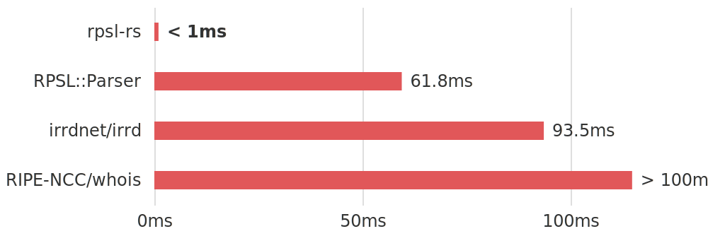

<h1 align="center"><code>rpsl-rs</code></h1>
<div align="center">
  <a href="https://github.com/srv6d/rpsl-rs/actions">
    
  </a>
  <a href="https://codecov.io/github/SRv6d/rpsl-rs">
    
  </a>
  <a href="https://codspeed.io/SRv6d/rpsl-rs">
    
  </a>
  <a href="https://crates.io/crates/rpsl-rs">
    
  </a>
  <a href="https://rust-lang.github.io/rfcs/2495-min-rust-version.html">
    
  </a>
</div>
<div align="center">
  <a href="https://scorecard.dev/viewer/?uri=github.com/SRv6d/rpsl-rs">
     
  </a>
  <a href="https://www.bestpractices.dev/projects/9525">
    
  </a>
<br />

A Routing Policy Specification Language (RPSL) parser with a focus on speed and correctness.

⚡️ 130-250x faster than other parsers\
📰 Complete implementation for multiline RPSL values\
💬 Able to parse objects directly from whois server responses\
🧠 Low memory footprint by leveraging zero-copy\
🧪 Robust parsing of any valid input ensured by Property Based Tests

[](docs/benchmark)

[**Docs**](https://docs.rs/rpsl-rs/latest/rpsl/) | [**Performance**](https://github.com/SRv6d/rpsl-rs/tree/main/docs/benchmark)

## Usage

### Parsing RPSL objects

A string containing an object in RPSL notation can be parsed to an [Object] using the [parse_object] function.

```rust
use rpsl::parse_object;

let role_acme = "
role:        ACME Company
address:     Packet Street 6
address:     128 Series of Tubes
address:     Internet
email:       rpsl-rs@github.com
nic-hdl:     RPSL1-RIPE
source:      RIPE

";
let parsed = parse_object(role_acme).unwrap();
```

The returned [Object] allows access to the attributes contained within in form of [Attribute]s.

```rust,ignore
println!("{:#?}", parsed);

Object(
    [
        Attribute {
            name: Name("role"),
            value: SingleLine(Some("ACME Company")),
        },
        Attribute {
            name: Name("address"),
            value: SingleLine(Some("Packet Street 6")),
        },
        Attribute {
            name: Name("address"),
            value: SingleLine(Some("128 Series of Tubes")),
        },
        Attribute {
            name: Name("address"),
            value: SingleLine(Some("Internet")),
        },
        Attribute {
            name: Name("email"),
            value: SingleLine(Some("rpsl-rs@github.com")),
        },
        Attribute {
            name: Name("nic-hdl"),
            value: SingleLine(Some("RPSL1-RIPE")),
        },
        Attribute {
            name: Name("source"),
            value: SingleLine(Some("RIPE")),
        },
    ]
)
```

[Object]s created from RPSL text use string references that point to attributes and their values
instead of copying them.

```text
role:           ACME Company ◀─────────────── &"role"    ───  &"ACME Company"
address:        Packet Street 6 ◀──────────── &"address" ───  &"Packet Street 6"
address:        128 Series of Tubes ◀──────── &"address" ───  &"128 Series of Tubes"
address:        Internet ◀─────────────────── &"address" ───  &"Internet"
email:          rpsl-rs@github.com ◀───────── &"email"   ───  &"rpsl-rs@github.com"
nic-hdl:        RPSL1-RIPE ◀───────────────── &"nic-hdl" ───  &"RPSL1-RIPE"
source:         RIPE ◀─────────────────────── &"source"  ───  &"RIPE"
```

This is what makes `rpsl-rs` performant and memory efficient, since no additional allocation is required during parsing.

Each [Attribute] can be accessed by its index and has a name and value.

```rust,ignore
println!("{:#?}", parsed[1]);

Attribute {
    name: Name("address"),
    value: SingleLine(Some("Packet Street 6")),
}
```

Since RPSL attribute values can either be single- or multiline, two different variants are used to represent them. See [Attribute] and [parse_object] for more details and examples.

### Parsing a WHOIS server response

WHOIS servers often respond to queries by returning multiple related objects.
An example ARIN query for `AS32934` will return with the requested `ASNumber` object first, followed by its associated `OrgName`:

```sh
$ whois -h whois.arin.net AS32934
ASNumber:       32934
ASName:         FACEBOOK
ASHandle:       AS32934
RegDate:        2004-08-24
Updated:        2012-02-24
Comment:        Please send abuse reports to abuse@facebook.com
Ref:            https://rdap.arin.net/registry/autnum/32934


OrgName:        Facebook, Inc.
OrgId:          THEFA-3
Address:        1601 Willow Rd.
City:           Menlo Park
StateProv:      CA
PostalCode:     94025
Country:        US
RegDate:        2004-08-11
Updated:        2012-04-17
Ref:            https://rdap.arin.net/registry/entity/THEFA-3


```

To extract each individual object, the [parse_whois_response] function can be used to parse the response into a `Vec` containing all individual [Object]s within the response. Examples can be found in the function documentation.

## Optional Features

The following cargo features can be used to enable additional functionality.

- **simd** _(enabled by default)_: Enables the [Winnow] simd feature which improves string search performance using simd.
- **serde**: Enables [Object] serialization using [Serde].
- **json**: Provides JSON serialization of an [Object] using [Serde JSON].

## MSRV Policy

This project requires the minimum supported Rust version to be at least 6 months old.
As long as this requirement is met, the MSRV may be increased as necessary through a minor version update.
For the currently configured MSRV, please check [Cargo.toml](Cargo.toml).

## Contributing

Contributions of all sizes that improve `rpsl-rs` in any way, be it DX/UX, documentation, performance or other are highly appreciated.
To get started, please read the [contribution guidelines](.github/CONTRIBUTING.md). Before starting work on a new feature you would like to contribute that may impact simplicity, reliability or performance, please open an issue first.

## License

The source code of this project is licensed under the MIT License. For more information, see [LICENSE](LICENSE).

[Object]: https://docs.rs/rpsl-rs/latest/rpsl/struct.Object.html
[Attribute]: https://docs.rs/rpsl-rs/latest/rpsl/struct.Attribute.html
[parse_object]: https://docs.rs/rpsl-rs/latest/rpsl/fn.parse_object.html
[parse_whois_response]: https://docs.rs/rpsl-rs/latest/rpsl/fn.parse_whois_response.html
[Winnow]: https://github.com/winnow-rs/winnow
[Serde]: https://github.com/serde-rs/serde
[Serde JSON]: https://github.com/serde-rs/json
