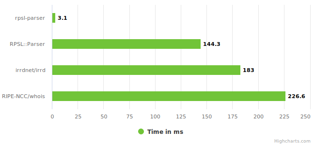

# benchmark

Benchmarks comparing performance to other RPSL parsers.

## Results

| Parser            | Mean               | Min      | Max      |
| ----------------- | ------------------ | -------- | -------- |
| **[rpsl-parser]** | 3.1 ms ± 0.1 ms    | 3.0 ms   | 5.4 ms   |
| [RPSL::Parser]    | 144.3 ms ± 0.6 ms  | 143.2 ms | 145.1 ms |
| [irrdnet/irrd]    | 183.0 ms ± 0.7 ms  | 182.1 ms | 184.4 ms |
| [RIPE-NCC/whois]  | 226.6 ms ± 11.9 ms | 208.7 ms | 245.1 ms |

_Parsing of the AS3257 aut-num object._

## Methology

For each benchmarked parser, a small executable is created in its native language that reads a file containing RPSL into memory, which is then passed to the parser. This executable is then benchmarked using [hyperfine].

## Running Benchmarks

`./run` in the directory of the specific parser sets up dependencies and runs a benchmark using [hyperfine]. It runs `sudo` and is only guaranteed to run correctly within the [benchmark workflow](https://github.com/SRv6d/rpsl-parser/blob/main/.github/workflows/benchmark.yml), which can be used as a reference for additionally required dependencies.

[rpsl-parser]: https://github.com/srv6d/rpsl-parser
[RPSL::Parser]: https://metacpan.org/pod/RPSL::Parser
[irrdnet/irrd]: https://github.com/irrdnet/irrd
[RIPE-NCC/whois]: https://github.com/RIPE-NCC/whois
[hyperfine]: https://github.com/sharkdp/hyperfine
